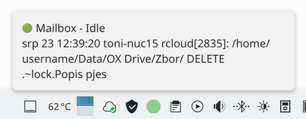
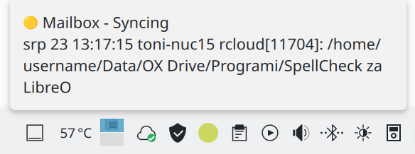
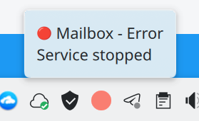
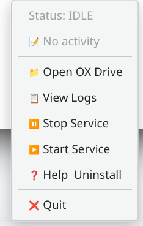
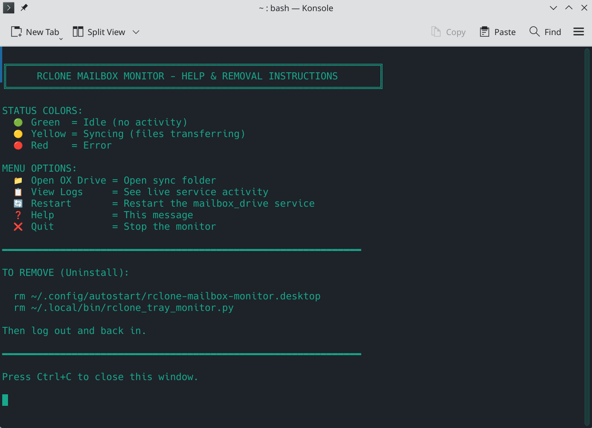

# Rclone Tray Monitor

Lightweight system tray monitor for **rclone** services on Linux.
It watches an **rclone systemd user service**, displays its current status in the system tray with colors and animations, and provides quick access to logs, your synchronized folder, and service controls.

Originally developed for **Mailbox.org WebDAV** and **OX Drive** based on workflows from https://codeberg.org/jfrickmann/rcloud. It can be adapted to **any rclone service**.


## Screenshots

| Idle State | Syncing State | Error State | Context Menu  | Help |
| :---: | :---: | :---: | :---: | :---: |
|  |  |  |  |  |


## Features

- 🟢 **Green** = Idle
- 🟡🔵 **Yellow-Blue pulse** = Syncing
- 🔴 **Red** = Error or service stopped
- **CPU Optimized:** Animation frame loop runs *only* during active syncing and pauses automatically when idle to conserve system resources.
- Live tooltip showing status and recent activity (Modtime warnings filtered out automatically)
- View systemd journal logs in real-time with smart terminal emulator fallbacks
- Stop or start the rclone service directly from the context menu
- Open your synchronized folder natively via `xdg-open`
- Lightweight, fast, and native PyQt6 application
- Works seamlessly on KDE Plasma, GNOME, XFCE, and other Linux desktop environments

## Quick Install

1. Download or clone the repository:
   ```bash
   git clone [https://github.com/emaus78/rclone-tray-monitor.git](https://github.com/emaus78/rclone-tray-monitor.git)
   cd rclone-tray-monitor


2. Run the installer:

   ```bash
   bash install.sh


3. Follow the quick prompts to auto-detect your service and directory.
4. Log out/back in (or run `~/.local/bin/rclone_tray_monitor.py &`).

## Requirements

* Python 3.7+
* PyQt6 (auto-installed by `install.sh`)
* Active rclone systemd user service
* Any standard Linux desktop environment

## Usage

Right-click the tray icon to open the context menu:

* 📁 **Open Folder** = Opens configured sync folder in your default file manager (`xdg-open`)
* 📋 **View Logs** = Opens live `journalctl` stream in your system terminal
* ⏸️ **Stop Service** = Temporarily stops the rclone systemd service
* ▶️ **Start Service** = Starts the rclone systemd service
* ❓ **Help & Uninstall** = Displays quick removal & status guide
* ❌ **Quit** = Stops the tray monitor app

## Manual Setup

If you prefer not using `install.sh`:

```bash
# 1. Install PyQt6
sudo pacman -S python-pyqt6   # Arch/Manjaro
# sudo apt install python3-pyqt6  # Debian/Ubuntu

# 2. Copy script
mkdir -p ~/.local/bin
cp rclone_tray_monitor.py ~/.local/bin/
chmod +x ~/.local/bin/rclone_tray_monitor.py

# 3. Configure script parameters (~/.config/rclone-tray-monitor/config.ini)
mkdir -p ~/.config/rclone-tray-monitor
cat > ~/.config/rclone-tray-monitor/config.ini << EOF
[Settings]
service_name = mailbox_drive.service
sync_path = /home/username/Data/OX Drive/
EOF

# 4. Create autostart entry
mkdir -p ~/.config/autostart
cat > ~/.config/autostart/rclone-mailbox-monitor.desktop << EOF
[Desktop Entry]
Type=Application
Name=Rclone Tray Monitor
Exec=$HOME/.local/bin/rclone_tray_monitor.py
Icon=utilities-system-monitor
Terminal=false
Categories=Utility;System;
StartupNotify=false
X-GNOME-Autostart-enabled=true
EOF

```

## Find Your Service Name

To find the exact systemd user service name running your sync:

```bash
# List services containing "rclone", "sync", "rdrive", or "drive"
systemctl --user list-units --type=service | grep -iE "rclone|sync|rdrive|drive"

# Or list all active user services
systemctl --user list-units --type=service
```

## Uninstall

To remove the monitor and autostart configuration:

```bash
rm ~/.config/autostart/rclone-mailbox-monitor.desktop
rm ~/.local/bin/rclone_tray_monitor.py
rm -rf ~/.config/rclone-tray-monitor

```

## Troubleshooting

* **Test PyQt6 installation:**
```bash
python3 -c "from PyQt6.QtWidgets import QApplication; print('OK')"

```


* **Check status of your systemd service:**
```bash
systemctl --user status your_service.service

```


* **Inspect live logs manually:**
```bash
journalctl --user -u your_service.service -n 20 -f

```


---

## Technical Notes

* The monitor runs in the background and stays in the tray when terminal windows are closed.
* Left-clicking the icon does not trigger popups by design; use right-click to open the menu.
* Sync status is held for a minimum of 3 seconds to ensure brief file operations remain visible in the tray.
* Modtime adjustment logs are automatically hidden to keep error and status messages clear.

---

MIT License | Happy syncing! 🚀
